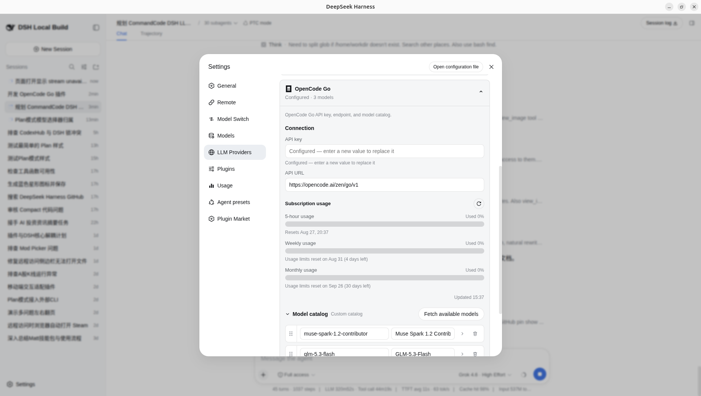

# dsh-llm-opencode-go

English | [中文](README.zh.md)

OpenCode Go integration for DeepSeek Harness. Chat uses the shared pi-ai adapter. Completions, Responses, or Anthropic Messages are selected per model from the official Go table. Model discovery and subscription usage stay on native Go endpoints because those capabilities are not part of the chat protocol.

The package root exposes the Cordis plugin contract and OpenCodeGoAdapter. The same artifact exports `./client`, which contributes the OpenCode Go card under Settings → LLM Providers. The protocol split is recorded in [ADR 0001](docs/adr/0001-one-route-triple-protocol.md).

## Installation

DeepSeek Harness 0.1.0-rc.6 or later is required. Install directly from GitHub:

~~~sh
dsh plugin --profile web add github:NOirBRight/dsh-llm-opencode-go#v0.1.8
dsh web
~~~

The repository tracks release-ready lib artifacts, so GitHub installation needs no build-script allowlist. A source checkout can use a link installation after running `pnpm run build`.

## Remote management

By default the plugin's settings RPC is loopback-only. When you open DSH from a non-loopback host (e.g. https://dsh.noirbright.top or http://192.168.50.75:3080), the card shows “A remote browser cannot edit plugin settings”.

To allow editing from a trusted host:

1. Add to your profile patch (`~/.dsh/profiles/web/cordis.patch.yml` for production, `~/.dsh-lab/profiles/web/cordis.patch.yml` for lab):
   ```yaml
   - id: llm-opencode-go
     config:
       remoteManagement: true
   ```
2. Restart DSH with the host allowlisted:
   ```sh
   dsh web --trusted-host 192.168.50.75 --trusted-host dsh.noirbright.top
   ```
   The current production launch already uses `--trusted-host 192.168.50.75 --trusted-host dsh.noirbright.top`; add any additional host you use.
3. Refresh the browser. Settings saved on the host keep working for remote sessions.

Without `remoteManagement: true`, use `ssh -L 3080:127.0.0.1:3080 user@host` and open `http://127.0.0.1:3080`.

Put this plugin **before** other LLM provider plugins in the profile bundle list so its LLM Providers section enumerates every installed card.

## Web configuration

Open Settings → LLM Providers → OpenCode Go. The provider-management RPC returns only decoded settings, revision, and value-free credential status; API keys are write-only and never echoed or logged. By default management is loopback-only. For an externally authenticated deployment, set `remoteManagement: true` and start DSH with an explicit `dsh web --trusted-host <host>` (or use SSH forwarding). Restart `dsh web` after changing this setting.

The card saves the public base URL and model catalog together as one revision-fenced `llm-opencode-go` settings mutation. Fetch available models opens the picker immediately. The Host reads `GET /zen/go/v1/models` and enriches ids with the documented catalog (context window, vision, thinking, and Completions / Responses / Messages).

When a key is stored, expanding the card refreshes subscription usage. With no key, the usage section stays idle. The Host reads `GET &lt;baseURL&gt;/usage` and renders the 5-hour, weekly, and monthly windows as consumed-percentage meters. The credential never crosses to the browser.

The model catalog starts collapsed and lists one row per model: a drag handle reorders rows (the order persists with the catalog), the chevron opens that row's context and capability flags, and the trash button removes it.

### Plugin configuration



The Models page lists saved `opencode-go` models and can select them. Current Harness releases do not expose a third-party editor slot inside that page, so this package owns its editor under LLM Providers.

## Capability and protocol split

Chat uses one `opencode-go` route. The adapter does **not** re-register that route as a configurable provider (the pi-ai catalog already owns the directory entry). Per-model `api` selects:

    openai-completions   POST /zen/go/v1/chat/completions
    openai-responses     POST /zen/go/v1/responses
    anthropic-messages   POST /zen/go/v1/messages

Native independent capabilities remain Host-only:

    model discovery   GET /zen/go/v1/models
    subscription usage   GET /zen/go/v1/usage

Official provider documentation: https://opencode.ai/docs/zh-cn/go/

## Config

~~~yaml
- id: llm-opencode-go
  name: dsh-llm-opencode-go
  config:
    apiKeyEnv: OPENCODE_API_KEY
    remoteManagement: false
    baseURL: https://opencode.ai/zen/go/v1
    defaultContextWindow: 262144
    streamIdleTimeoutMs: 300000
    models:
      - id: muse-spark-1.2-contributor
        name: Muse Spark 1.2 Contributor
        contextWindow: 1048576
        maxTokens: 131072
        vision: true
        thinking: true
        defaultEffort: medium
        api: openai-responses
      - id: glm-5.3-flash
        name: GLM-5.3-Flash
        contextWindow: 1000000
        thinking: true
        defaultEffort: high
        api: openai-completions
~~~

The provider route remains `opencode-go` and the settings namespace remains `llm-opencode-go`. Only configured catalog models are accepted for chat. Per-row `contextWindow` is the DSH compaction budget. The fallback context window is 262,144 tokens.

### Model capabilities

`vision` controls text/image input modalities. `thinking` enables selectable reasoning efforts. Known Go families pin a plugin `defaultEffort` when the session has not picked one. `api` is required for dispatch; unknown ids fall back to the documented family table.

Muse Spark requires the OpenCode workspace toggle for training-data models. DeepSeek V4 Flash requires the toggle for models hosted in China. Those are account flags on https://opencode.ai, not plugin settings.

## Model experience

The system prompt and provider-neutral messages are translated by PiAiAdapter into Completions, Responses, or Messages. Tool calls retain provider-issued ids. Images are encoded as base64 data URLs only for vision models.

Usage maps to Harness input/output counts. maxTokens is clamped against the configured context capacity by pi-ai.

## Known limitations

- Provider management defaults to loopback. Enable `remoteManagement: true` only behind external authentication and an explicit `dsh web --trusted-host <host>`; restart DSH after changing it. SSH port forwarding remains the safest alternative.
- A leftover `~/.dsh/.credentials.yaml.lock` written by CodexHub (`codexhub-atomic-lock=1`) blocks every DSH `credentials.set` until the sidecar is deleted. See CodexHub `docs/tasks/dsh-credentials-lock-interop.md`.
- This package does not call `registerConfigurableProviders` for `opencode-go` (duplicate directory with llm-pi-ai).
- GenerateOptions.stop is not supported by the shared PiAiAdapter.
